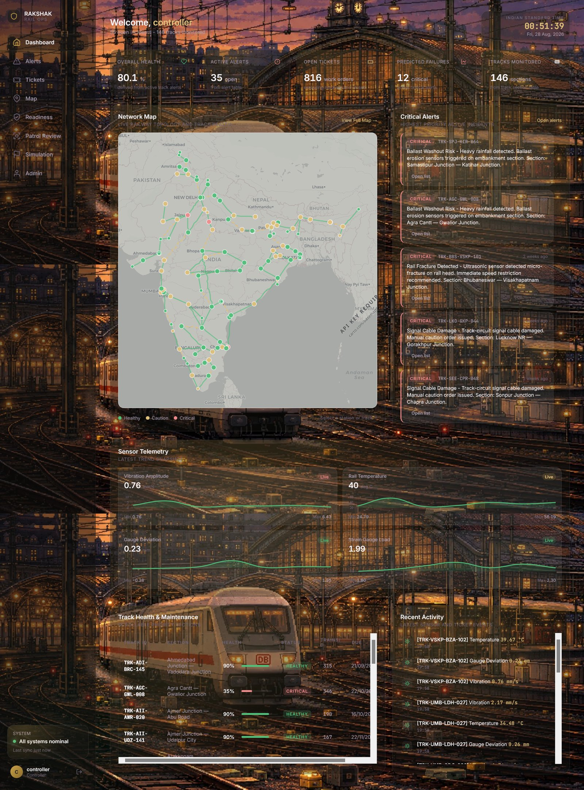
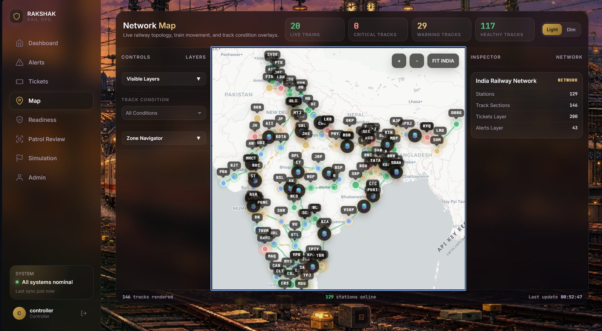
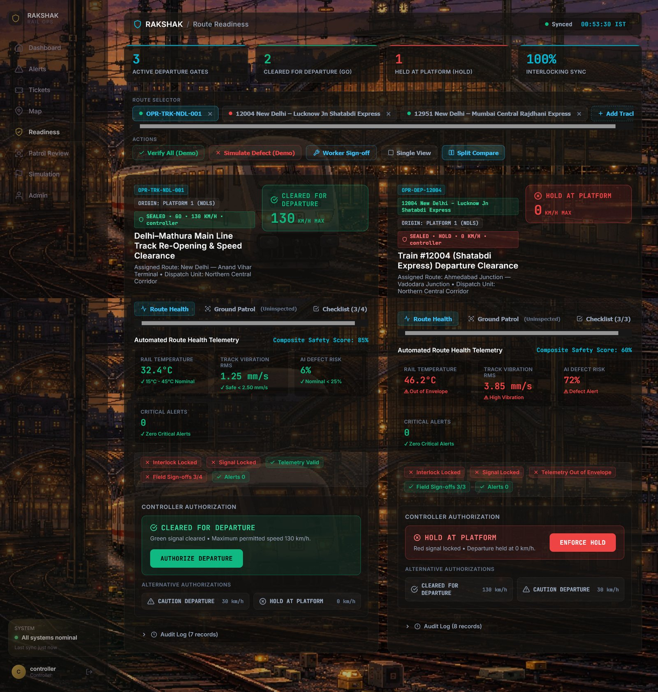
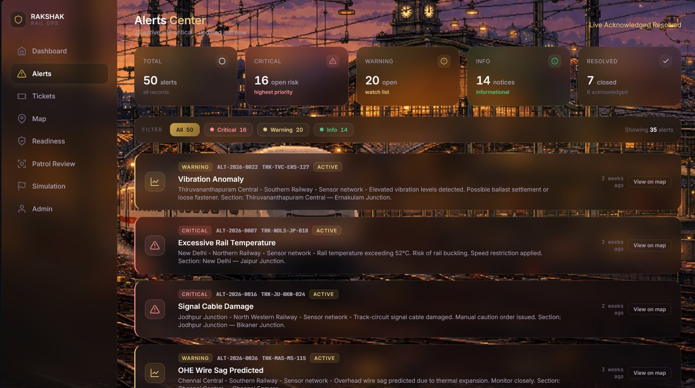
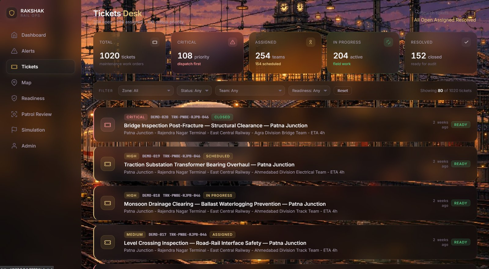
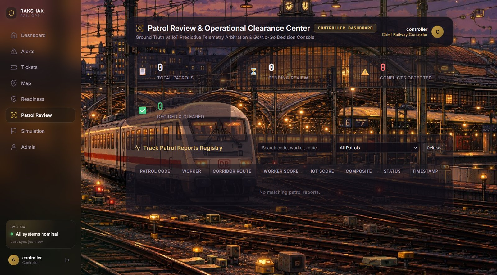

# RAKSHAK

### Railway Safety & Operational Intelligence — Functional Prototype

Rakshak is a functional prototype that brings railway safety monitoring, route readiness, network visualization, alerts, patrol inspection, maintenance ticketing, and simulated operational telemetry into a single operator-facing interface.

Built on a Django backend with server-rendered templates, interactive Leaflet-based maps, Chart.js telemetry visualization, a multi-model ML inference pipeline, and a multi-provider AI simulation engine, the project demonstrates what a unified railway operations control center could look like.

> **Prototype Notice**
>
> Rakshak is a demonstration and proof-of-concept system. Sensor telemetry is generated through simulation engines, and operational workflows are development-oriented. This is not a production railway control system and should not be interpreted as one.

---

## Screenshots

### Operations Dashboard



The main control center surfaces five KPI cards (overall health, active alerts, open tickets, predicted failures, tracks monitored), four real-time sensor trend charts with threshold-based color coding, a Leaflet network overview map with station and route health, a critical alerts panel, and an operator activity log.

### Network Map



A full-page interactive Leaflet map displaying the railway network with color-coded station markers (by health status), route polylines (by track condition), maintenance ticket locations, active alert markers with pulse animations, and simulated live train positions. Supports layer toggling, search filtering, dark/light themes, and route detail selection.

### Operational Readiness



A flight-deck-inspired readiness control center with a tabbed track workspace (drag-and-drop, pin, close), departure gate status annunciators, split-view case comparison, sensor telemetry meter displays, field checklist sign-off, controller Go/Caution/No-Go decisions with override capability, and an immutable audit timeline.

### Alerts Center



Filterable alert management with severity summary cards (critical, warning, info), status tabs (live, acknowledged, resolved), severity filter chips, and detailed alert cards showing track section, zone, sensor identity, confidence score, and time-ago information.

### Tickets Desk



Maintenance ticket management with status filters, full-text search, summary KPIs (total, critical priority, assigned teams, in-progress, resolved), and a detailed ticket table with priority, team assignment, ETA, cost tracking, and linked alerts.

### Patrol Review



Controller dashboard for reviewing patrol submissions, comparing worker scores against IoT-predicted telemetry, adjusting worker/IoT weight contributions via sliders, viewing Chart.js IoT reading charts, and issuing Go/Restrict/Block operational decisions with auto-refresh polling.

---

## What is Rakshak?

Railway operations involve multiple, typically siloed sources of information — network conditions, train movement, route readiness, safety alerts, field patrol observations, maintenance issues, and operational telemetry. Rakshak explores the idea of bringing these signals into one unified interface.

The prototype demonstrates how an operator-oriented platform could provide:

- **Network visibility** — live map-based awareness of stations, routes, and train positions
- **Sensor telemetry** — real-time charts and threshold monitoring for vibration, temperature, gauge deviation, and strain
- **Route readiness monitoring** — departure gate workflows with checklist verification and controller sign-off
- **Alert awareness** — severity-classified, filterable alert management with escalation tracking
- **Patrol review** — ground-truth field inspection arbitrated against IoT predictions
- **Maintenance ticketing** — priority-based work order lifecycle with team assignment and cost tracking
- **Simulated telemetry** — on-demand synthetic sensor journey generation with live ML prediction
- **Audit trail** — immutable, append-only logging of all operational decisions and entity changes

---

## Core Features

| Module | What the Prototype Demonstrates |
|---|---|
| Dashboard | Consolidated operational KPIs, sensor trend charts, network map overview, critical alerts, activity log |
| Network Map | Interactive Leaflet map with stations, routes, tickets, alerts, and simulated train positions |
| Operational Readiness | Departure gate workflow with field checklists, sensor evaluation, controller decisions, audit timeline |
| Alerts | Severity-classified alert monitoring with status lifecycle and confidence scoring |
| Tickets | Maintenance work order tracking with priority, team assignment, ETA, and cost management |
| Simulation | Live synthetic IoT journey generation with multi-provider AI and real ML pipeline prediction |
| Patrol Inspection | RDSO-standard field inspection with 8-category rating and automated IoT telemetry generation |
| Patrol Review | Controller arbitration of worker ground-truth vs. IoT prediction with Go/Restrict/Block decisions |

---

## Feature Walkthrough

### Dashboard

The operations dashboard is the primary entry point after authentication. It provides a consolidated operational view of the prototype environment.

**What it demonstrates:**

- **5 KPI cards** — Overall Health (derived from active track alerts), Active Alerts, Open Tickets, Predicted Failures (critical alerts), and Tracks Monitored
- **4 sensor trend charts** — Vibration RMS, Temperature, Gauge Deviation, and Strain, rendered via Chart.js with gradient fills and dynamic threshold-based color coding (healthy/warning/critical)
- **Network overview map** — An embedded Leaflet map fetching station and route data from the API, with health-based color coding and a selection detail panel
- **Critical alerts panel** — Most recent high-severity alerts with direct links
- **Operator activity log** — Recent sensor readings and system activity
- **Live IST clock** — Real-time Indian Standard Time display

### Network Map

The full-page interactive map provides situational awareness across the railway network.

**What it demonstrates:**

- **5 data layers** — Stations, Routes, Tickets, Alerts, and Trains, each toggleable
- **Station markers** — Color-coded by health status with popup information (zone, division, type, coordinates)
- **Route polylines** — Track sections rendered from GeoJSON geometry, colored by condition status
- **Ticket markers** — Active maintenance tickets plotted at their track section locations with priority coloring
- **Alert markers** — Active alerts with animated pulse indicators
- **Train simulation** — Simulated train positions via periodic API polling with movement markers
- **Theme switching** — Dark and light map tile themes
- **Search and filtering** — Station/route search with keyboard navigation
- **Stats bar** — Aggregate network statistics (total stations, routes, active alerts, open tickets)

### Operational Readiness

The readiness center demonstrates a departure clearance workflow inspired by flight-deck annunciator patterns.

**What it demonstrates:**

- **Annunciator strip** — Active departure gates, GO/HOLD counts, interlocking sync status
- **Track workspace** — Tabbed case management with drag-and-drop reordering, pin/close, and localStorage persistence
- **Case cards** — Dual-tab view (Health metrics / Checklist items) for each readiness case
- **Sensor telemetry display** — Visual meter indicators for vibration, temperature, gauge width, and ambient conditions
- **Field checklist sign-off** — Individual checklist items with AJAX-based sign-off (simulated field verification)
- **Controller decision modal** — Go / Caution / No-Go decision with speed clearance input and override capability
- **Audit timeline** — Immutable, append-only record of all state transitions and decisions
- **Split-view mode** — Side-by-side case comparison for simultaneous evaluation
- **Deep-link support** — Direct URL access to specific cases via `?case=` parameter

> *Note: "Verify All" and similar bulk actions are prototype convenience features for demonstration purposes, not production railway operational commands.*

### Alerts Center

The alerts page demonstrates severity-classified operational alert monitoring.

**What it demonstrates:**

- **Summary cards** — Total, Critical, Warning, Info, and Resolved counts
- **Status tabs** — Live, Acknowledged, and Resolved alert views
- **Severity filters** — Filter chips with badge counts for each severity level
- **Alert cards** — Each alert displays its type (anomaly, threshold breach, prediction, manual, system), severity, affected track section, zone, originating sensor, ML confidence score, and relative timestamp
- **Three severity levels** — Critical (>= 0.85 confidence), Warning (>= 0.65), and Info (>= 0.40) based on centralized thresholds

### Tickets Desk

The tickets page demonstrates maintenance work order lifecycle management.

**What it demonstrates:**

- **Summary KPIs** — Total tickets, Critical priority, Assigned teams, In Progress, Resolved counts
- **Status filtering** — All, Open, Assigned, and Resolved views
- **Full-text search** — Live search across ticket fields via API
- **Ticket table** — Priority level, assigned maintenance team, estimated completion time, cost tracking (INR), linked alerts, and status lifecycle logging

### Live Simulation

The simulation environment generates fresh, never-seen sensor journeys on demand and feeds them through the real Rakshak ML prediction pipeline. This is a staff-only feature.

**What it demonstrates:**

- **Station selection** — Autocomplete dropdowns populated from the station database
- **Track condition presets** — Auto (smart detection), Nominal, Thermal Buckle Risk, Gauge Widening, High Vibration
- **Route preview** — Real track path between selected stations rendered on a Leaflet map
- **Train animation** — Terminal-style animated journey with a minimum 5-second visual
- **Live IoT generation** — 16-reading synthetic sensor journey (ambient temperature, humidity, vibration RMS, gauge width) produced by a multi-provider fallback chain:
  1. Google Gemini API
  2. xAI Grok API
  3. Anthropic Claude API
  4. OpenAI API
  5. Local Ollama
  6. Dynamic physics-based IoT RNG engine (always available offline, uses correlated Brownian bridge and micro-vibration noise)
- **ML prediction** — The 16th reading (when the sliding window is full) triggers the real PredictionService pipeline
- **Results display** — Alert level badge, fault classification, sensor reading chart, AI-generated suggestions, and a direct link to the automatically created Readiness case

> *All telemetry in the simulation is synthetically generated. No real railway sensor data is used.*

### Patrol Inspection

The patrol interface allows field workers to submit on-ground track inspection reports following RDSO (Research Designs and Standards Organisation) standards.

**What it demonstrates:**

- **Track section selection** — Dropdown of active track sections
- **8 inspection categories** — Based on IRPWM (Indian Railways Permanent Way Manual) standards, each rated 1–5 via interactive sliders:
  - Rail condition, fastenings, sleepers, ballast, drainage, geometry, welds, and general safety
- **Quick presets** — Nominal, Good, and Degraded one-click condition profiles
- **Notes per category** — Free-text observations for each inspection area
- **Automated IoT generation** — Upon submission, the system generates synthetic IoT telemetry for the inspected section (with a 30% chance of anomalous scenarios) and runs it through the ML prediction pipeline
- **Case creation** — Automatically creates or updates an OperationalReadinessCase linking the patrol to the readiness workflow

### Patrol Review

The controller dashboard demonstrates arbitration between human ground-truth (worker patrol scores) and machine prediction (IoT telemetry).

**What it demonstrates:**

- **Patrol table** — All submitted patrols with search and status filtering
- **Detail panel** — Worker score vs. IoT prediction score comparison
- **Weight adjustment** — Interactive sliders to adjust the worker/IoT weight contribution to the composite score
- **IoT telemetry charts** — Chart.js visualization of the 16-reading IoT data generated during patrol
- **Operational decision** — Go (Cleared), Restrict, or Block decision with controller sign-off
- **Auto-refresh** — 10-second polling for new patrol submissions
- **Conflict detection** — KPI tracking of worker vs. IoT score disagreements

---

## Prototype Objective

The engineering objective of Rakshak is to explore a unified operational interface where information that would normally be distributed across different railway systems — SCADA, asset management, maintenance dispatch, field inspection, alerting, and telemetry — can be surfaced through a common situational-awareness layer.

The prototype demonstrates:

1. **Unified operational visibility** — A single dashboard aggregating KPIs, sensor trends, alerts, and network status
2. **Map-based railway awareness** — Interactive geographic visualization of the entire network state
3. **Readiness workflows** — Structured departure clearance with field verification, controller decisions, and audit trails
4. **Alert handling** — Severity-classified monitoring with confidence scoring from ML predictions
5. **Field activity visibility** — Ground-truth patrol inspection arbitrated against automated predictions
6. **Simulated telemetry** — On-demand synthetic sensor data generation with real ML inference
7. **Modular backend/frontend integration** — 10 Django apps with clean separation of concerns, 30+ API endpoints, and role-based access control
8. **Immutable audit system** — Append-only audit logging across all entity changes and operational decisions

---

## System Architecture

```
                    ┌──────────────────────────────────┐
                    │        Rakshak Frontend           │
                    │   Django Templates + Leaflet.js   │
                    │   + Chart.js + Vanilla JS         │
                    └───────────────┬──────────────────┘
                                    │
                                    ▼
                    ┌──────────────────────────────────┐
                    │         Django Backend            │
                    │    10 Apps · 30+ API Endpoints    │
                    │    Role-Based Access Control      │
                    └───────────────┬──────────────────┘
                                    │
              ┌─────────────────────┼─────────────────────┐
              ▼                     ▼                     ▼
    ┌──────────────────┐  ┌──────────────────┐  ┌──────────────────┐
    │    PostgreSQL     │  │   ML Pipeline    │  │  AI Simulation   │
    │    (Supabase)     │  │  PyTorch + SKL   │  │   Multi-Provider │
    │                   │  │  Inference Only   │  │   Fallback Chain │
    │  22+ Models       │  │                  │  │                  │
    │  Immutable Audit  │  │  Failure Pred.   │  │  Gemini / Grok   │
    │  GeoJSON Routes   │  │  Fault Classif.  │  │  Claude / OpenAI │
    │                   │  │  Anomaly Det.    │  │  Ollama / Physics │
    └──────────────────┘  │  VAE + Meta      │  │  RNG Engine      │
                          └──────────────────┘  └──────────────────┘
```

### Backend Apps

| App | Responsibility |
|---|---|
| `core` | Shared views, context processors, navigation |
| `railway` | Domain models (22+ models), signals, audit middleware, management commands |
| `sensors` | Dashboard view, prediction API endpoints |
| `alerts` | Alert management views and URLs |
| `tickets` | Ticket management views, search API |
| `map_view` | Map page view, 6 JSON API endpoints (stations, routes, tickets, alerts, summary, trains) |
| `simulation` | Live simulation engine, multi-provider IoT generator, route/station APIs |
| `readiness` | Operational readiness center, case management, checklist sign-off, decision APIs |
| `patrol` | Worker patrol inspection, admin review, weight adjustment, Go/Restrict/Block decision |
| `ai_integration` | AI provider framework, prediction service facade, alert/ticket orchestration |

### Data Model (7 Layers, 22+ Models)

| Layer | Models | Purpose |
|---|---|---|
| Geography | Zone, Division, Station | 18 Indian Railways zones, divisions, stations with GPS coordinates |
| Infrastructure | TrackSection, Asset | Track segments with gauge type, speed limits, geometry; bridges, signals, OHE, crossings |
| Sensor | SensorType, Sensor, SensorCalibration, SensorReading | UUID-identified devices, calibration history, raw/processed readings with anomaly flags |
| Alert | Alert, AlertEscalation | 5 alert types, 3 severity levels, 4 statuses, escalation tracking |
| Maintenance | MaintenanceTeam, Ticket, TicketStatusLog | Priority-based lifecycle, cost tracking (INR), team assignment |
| Readiness | OperationalReadinessCase, ReadinessChecklistItem, ReadinessAuditRecord | Track reopening/departure clearance, field verification, immutable audit |
| ML | MLModel, MLModelRun, AnomalyPrediction | Model registry, execution tracking, per-reading predictions with feature importances |

### ML Inference Pipeline

```
Simulation / Patrol / API Request
        │
        ▼
PredictionService  (business-logic facade)
        │
        ▼
AIProviderRegistry  (selects provider from settings)
        │
        ▼
LocalPickleProvider  (wraps RakshakInferencePipeline)
        │
        ├── Failure Predictor
        ├── Fault Classifier
        ├── Isolation Forest (anomaly detection)
        ├── VAE Anomaly Detector
        └── Meta Classifier (ensemble)
        │
        ▼
PredictionResponse → IncidentOrchestrator
                          ├── AlertService  → creates Alerts
                          └── TicketService → creates Tickets
```

Training is performed offline via Google Colab notebooks (`ai_engin/colab_training/`). Trained `.pkl` models are loaded at inference time from `backend/ai_models/`.

---

## Tech Stack

| Layer | Technology |
|---|---|
| Backend | Python 3.10+, Django 4.2 |
| Database | PostgreSQL via Supabase (Session Pooler), `psycopg[binary]` 3.1+, `dj-database-url` |
| ML Inference | PyTorch 2.2+, scikit-learn 1.3+, NumPy 1.26+ |
| Frontend | Django Templates, vanilla JavaScript (ES6+) |
| Maps | Leaflet.js 1.9 |
| Charts | Chart.js 4.4 |
| Fonts | Inter (body), JetBrains Mono (data/monospace) |
| Styling | Custom CSS with glassmorphic dark theme, CSS custom properties, backdrop filters |
| AI Providers | Google Gemini, xAI Grok, Anthropic Claude, OpenAI, Ollama (multi-provider fallback) |
| Authentication | Django built-in auth with role-based access (controller, viewer, worker) |

---

## Getting Started

### Prerequisites

- Python 3.10+
- A PostgreSQL database (Supabase recommended)
- Git
- pip

### Clone and Setup

```bash
git clone https://github.com/Arnav131/PROTOTYPE_1.0.git
cd PROTOTYPE_1.0/backend
```

### Create Virtual Environment

```bash
python -m venv .venv
.venv\Scripts\activate        # Windows
# source .venv/bin/activate   # Linux / macOS
```

### Install Dependencies

```bash
pip install -r requirements.txt
```

This installs the full stack including Django, PostgreSQL driver, PyTorch, scikit-learn, and NumPy. The ML prediction pipeline is a core feature, not optional.

### Configure Environment

Copy `.env.example` to `.env` in the `backend/` directory and set your database connection:

```env
DATABASE_URL=postgresql://postgres.<PROJECT_REF>:<PASSWORD>@aws-<REGION>.pooler.supabase.com:5432/postgres?sslmode=require
DEBUG=True
```

For the simulation engine's LLM-powered telemetry generation (optional — the physics engine works offline):

```env
GEMINI_API_KEY=your-key-here
GROK_API_KEY=xai-your-key-here
ANTHROPIC_API_KEY=your-key-here
OPENAI_API_KEY=your-key-here
```

### Initialize Database

Run migrations and seed commands **in order**:

```bash
python manage.py migrate
python manage.py seed_master_data
python manage.py seed_routes
python manage.py seed_sensors
python manage.py seed_demo_data
python manage.py seed_readiness_data
python manage.py seed_users
```

### Run the Server

```bash
python manage.py runserver
```

The application starts at `http://127.0.0.1:8000/`.

### Demo Accounts

| Username | Password | Role | Access |
|---|---|---|---|
| `controller` | `admin123` | Superuser / Staff | Full access — Dashboard, Map, Alerts, Tickets, Readiness, Simulation, Patrol Review |
| `viewer` | `viewer123` | Read-only | Dashboard, Map, Alerts, Tickets, Readiness |
| `worker` | `worker123` | Patrol Worker | Patrol Inspection interface |

---

## API Reference

The prototype exposes 30+ REST endpoints across six API namespaces:

| Namespace | Endpoints | Purpose |
|---|---|---|
| `/api/` | `stations/`, `routes/`, `tickets/`, `alerts/`, `summary/`, `trains/` | Map data layers and network statistics |
| `/api/predict/` | `POST /`, `GET /health/`, `POST /batch/` | ML inference (single, batch, health check) |
| `/api/ai/` | `POST /predict/`, `POST /predict/batch/`, `GET /health/`, `GET /providers/` | AI subsystem with provider registry |
| `/api/simulation/` | `POST /run/`, `GET /stations/`, `GET /route/` | Live journey simulation and route data |
| `/api/patrol/` | `POST /start/`, `GET /reports/`, `GET /<code>/`, `POST /<code>/submit/`, `POST /<code>/weights/`, `POST /<code>/decide/` | Patrol lifecycle and admin decisions |
| `/readiness/api/` | `GET /cases/`, `GET /cases/<code>/`, `POST /cases/<code>/sign-off/`, `POST /cases/<code>/decide/` | Readiness case management and decisions |

---

## Project Structure

```
PROTOTYPE_1.0/
├── backend/                          # Django project root
│   ├── manage.py
│   ├── rakshak_project/              # Settings, URLs, WSGI/ASGI
│   ├── core/                         # Shared views, context processors
│   ├── railway/                      # Domain models, signals, audit, migrations, seeders
│   ├── sensors/                      # Dashboard view, prediction APIs
│   ├── alerts/                       # Alert management
│   ├── tickets/                      # Ticket management, search API
│   ├── map_view/                     # Map view, 6 JSON APIs, route geometry
│   ├── simulation/                   # Simulation engine, multi-provider generator
│   ├── readiness/                    # Operational readiness center
│   ├── patrol/                       # Patrol inspection and admin review
│   ├── ai_integration/              # AI provider framework, prediction service
│   ├── ai_models/                    # Trained .pkl model files
│   └── agents/                       # AI agent layer
├── frontend/
│   ├── templates/                    # 11 Django HTML templates
│   └── static/
│       ├── css/                      # Glassmorphic dark theme stylesheets
│       ├── js/                       # Page-specific JavaScript modules
│       ├── images/                   # Background images
│       └── data/                     # GeoJSON railway data, station/zone configs
├── ai_engin/                         # ML training pipeline (Colab-based)
│   ├── colab_training/               # Model training modules
│   ├── inference/                    # Runtime inference pipeline
│   └── trained_models/               # Exported model storage
├── notebooks/                        # Colab training notebooks
├── docs/                             # Architecture docs, reports
├── requirements.txt
└── README.md
```

---

## Deployment

For deployment beyond local development, configure the following environment variables:

```bash
DATABASE_URL="postgresql://..."    # Required — PostgreSQL connection string
SECRET_KEY="change-me"             # Required — Django secret key
DEBUG="False"                      # Required — disable debug mode
ALLOWED_HOSTS="your-domain.com"    # Required — comma-separated hostnames
```

The application uses Django's standard WSGI interface (`rakshak_project.wsgi`) for production deployment behind any WSGI-compatible server (Gunicorn, uWSGI, etc.).

---

## License

This project is a functional prototype built for demonstration and educational purposes.

---

<sub>Rakshak — Railway Safety & Operational Intelligence Prototype</sub>
